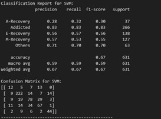

# Drug_Mentor_Recommender
An end-to-end NLP system that analyzes a text to identify drug addiction stages and enables personalized mentor recommendations.

The project's main goal is to identify users' stages of addiction or recovery and to facilitate personalized peer support through a mentor recommendation system.

## Key Feautres

* Linguistic Analysis: Employs Linguistic Inquiry and Word Count (LIWC) to identify linguistic patterns that correspond to different stages of addiction and recovery.

* Stage Classification: Uses a machine learning model to classify Reddit posts into five distinct categories: Addicted, Early Recovery, Maintaining Recovery, Advanced Recovery, and Others.

* Mentor Recommendation System: A novel framework that identifies users expressing an intention to recover and pairs them with suitable mentors who have navigated similar recovery paths.

* Automated Workflow: The project uses an automated pipeline for data analysis, model training, and deployment.

### Demo

This project has been deployed on Hugging Spaces: https://huggingface.co/spaces/benyell/drugmentor 

## Methodology

### Data

The project utilized a dataset of 10,000 posts from drug addiction-related subreddits on Reddit. A subset of 3,152 posts were manually labeled to create a gold standard dataset.

The posts were categorized into five classes: Addicted, Early Recovery, Maintaining Recovery, Advanced Recovery, and Others.

### Feature Engineering

A variety of features were extracted to train the classifier:

* LIWC-based Features: Categorizes text into 64 psycho-linguistic semantic categories to analyze language variation across stages.
* Sentiment Polarity: Examines the ratio of negative to positive emotion words to track shifts in emotional expression.
* Unigram and Bigram Features: Analyzes individual words and pairs of words to capture linguistic patterns.
* Word-based Features: Uses specific glossaries related to health, addiction, and recovery.

<table>
  <tr>
    <td>
      
      
Top LIWC Categories

    </td>
    <td>
      
      
Linguistic analysis - Additcted vs E-Recovery

    </td>
  </tr>
  <tr>
    <td>
      
      
Linguistic analysis - E-Recovery vs M-Recovery

    </td>
    <td>
      
      
Linguistic analysis - M-Recovery vs A-Recovery

    </td>
  </tr>
</table>

### Models

Three non-neural classifiers were evaluated using 10-fold cross-validation and SMOTE for data balancing:

* Support Vector Machines (SVM)
* Gaussian Naive Bayes
* Logistic Regression (LR)

<table>
  <tr>
    <td>
      
      
SVM

    </td>
    <td>
      
      
Log Regression

    </td>
    <td>
      
      
Naive Bayes

    </td>
  </tr>
</table>

## Results

Logistic Regression emerged as the top-performing model, achieving the highest accuracy and F1-scores.

Overall Accuracy: 70%

Mentor Recommender Accuracy: The specialized classifier for identifying users with an "intention to recover" achieved an accuracy of 75.4%.

Linguistic analysis revealed significant differences in language usage between different recovery stages, with Addicted posts showing a more negative emotional tone compared to Advanced Recovery posts.

## Mentor Recommendation System

The mentor system uses a multi-step process to connect users:

1. Identify Recovery Intent: The system identifies posts from addicted individuals who have expressed an intention to recover.

2. Extract Drugs: It extracts the drugs mentioned in the user's post by matching them against a curated database of common drug names.

3. Find Mentors: It searches a pre-built dictionary of recovered users who have experience with the same drugs.

4. Ranking: Mentors are ranked based on the number of shared drugs, community engagement (number of comments), and influence (post score).

